# Universal Search Tool

This is the demo of a universal search engine that allows users to quickly find relevant search results based on a specific keyword across contacts, calendar, dropbox, twitter and slack. Here's the full video demo.

## Getting Started

### Installation

```
npm install
```

To generate the bundle file with Webpack:

```
npm run build
```

To start the server:

```
npm start
```

Finally, open http://localhost:3000/ on your browser.

Suggested search term with the most results: **Acme**

## Additional Feature

User interaction with search results (pin, delete, tagging):

**Pin**:

- [x] As a user, I can pin my search results to the pin board by clicking on the pin icon next to the result, which will then be marked in orange.

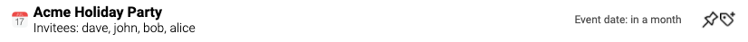

- [x] As a user, I can remove pinned search results by clicking on the pin icon from the pin board or results board.

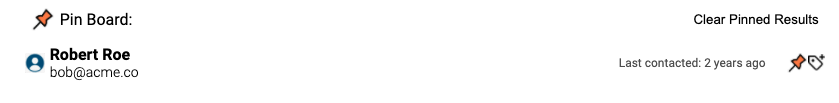

**Tag**:

- [x] As a user, I can tag my search results based with specific keywords by clicking on the tag icon, which will prompt the Edit Tags box.


- [x] As a user, I can add tags to a specific search result.

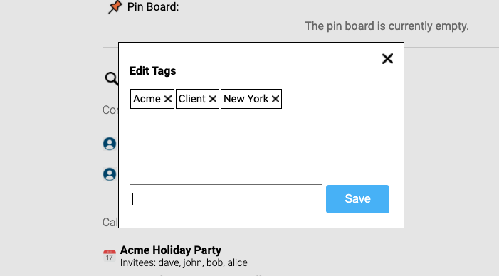

- [x] As a user, I can retrieve search results based on a specific tag from the tag menu or by directly typing a tag name (starting with "#") in the search box.

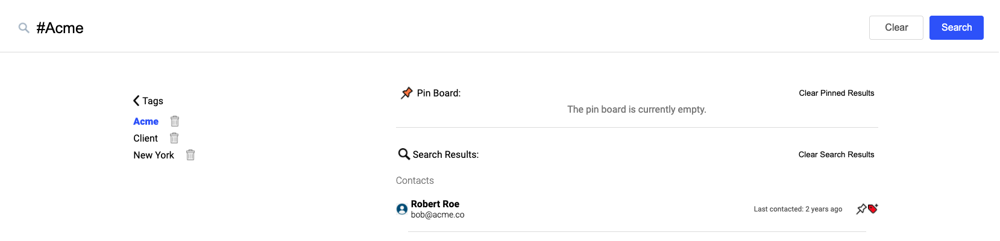

**Delete Tag**:

- [x] As a user, I can delete the tags on a specific result by clicking on the cross next to the tag name in the Edit Tags box.

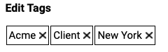

- [x] As a user, I can untag all the results related to specific tag by clicking on the Trash icon in the tag menu.

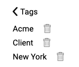

## Design Decisions

### **The search results are ordered based on category:**

- **Reason**: Grouping the results by category will allow the user to filter the results at his/her convenience. This feature becomes more handy as the list of search results becomes longer for different categories and doesn't fit into a single page. The **Reason**s for the order of Contacts > Calendar > Dropbox > Slack > Twitter is that Contacts and Calendar first are more likely to be searched on a daily basis.

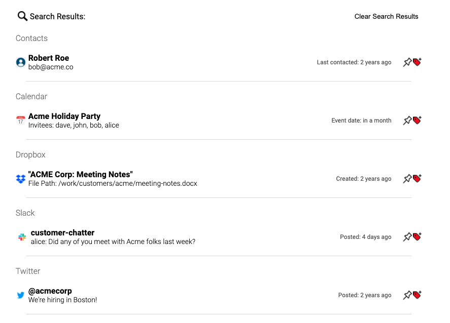

- **Trade-off**: Ideally, the top result should be prioritized based on “top hits”, similar to the feature on Spotlight Search on Mac, which can be a combination of relevance and frequency of usage.

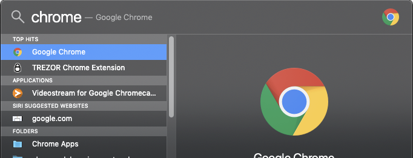

- Alternatively, the result can also be ordered by the degree of precision on the matching term (which would get more precise as more words are added into the search), and use machine learning to better optimize the relevance of the search based on time or location. For example, a user is less likely to be querying for a John in San Francisco if he/she is in New York, or querying for an event if it has already passed.

### **The results are based on relative time:**

- **Reason**: It would be more practical for the user to get a general sense of recency instead of mentally calculating dates and times and count back from the present day. For example, if the user queries for an event, it might be more helpful to know that it will happen in 2 hours or 2 days instead of a specific date. A potential issue with absolute date/time is that it might require the user to convert timezones to get their local time (when traveling or working with remote teams), leading to more chance for calculations errors, and consequently missing events or meetings.
- **Trade-off**: the absolute time display will provide more accuracy and can be more helpful if the user wants to see an exact date.

### **The results are ordered by recency within each category:**

- **Reason**: The results are ordered based on recency as it would be more likely to be relevant to a user. For example, a user is more likely to search an upcoming event instead of a past event, or looking for a more recent slack message instead of a message from a month ago.

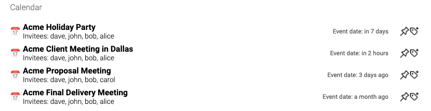

- **Trade-off**: Ordering the results this way might prioritize recency over accuracy on the search, which might not always be the right approach.

### **The pin board allows users to pin search results:**

- **Reason**: I ultimately made the decision to include the pin board on the main page instead of having it on a separate page (like the "favorite" section on Google Drive). The **Reason** of the decision is that having the pin board on a separate page might make be redundant from tags. Instead, users can make a multiple relevant queries (such as looking up for a client's contact info, finding a specific contract, and looking for recent Twitter news for the specific company ) and pin specific results to the pin board, which would be more like a temporary work station. For long term storage queries, users can add tags to results and access them at any time in the future. In sum, having a pin board can provide more convenience and productivity value to the user and avoid redundancy of having two ways of storing information for the long term.

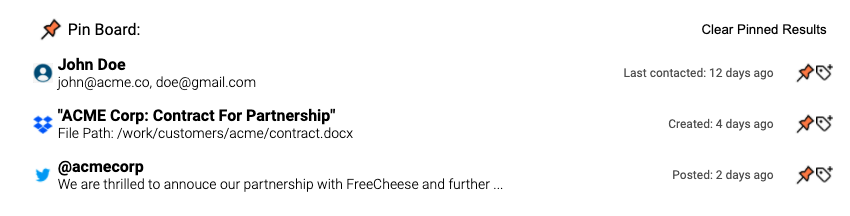

- **Trade-off**: Ideally the pin board should be used as temporary result storage and be cleared often. If the pin board gets too long, it could take up too much space. A way to mitigate this would be to make the pin board collapsible. More UX research would be required to see if users actually wants this feature, but also if they use the board as temporary or long term storage due to the convenience of one-click pinning.

### **The spinner animation helps provide feedback to the user:**

- **Reason**: Searching across multiple sources could take time and having a loading animation would give the feedback that data is being fetched, suggesting the user to avoid to remain on the page and avoid re-submitting the same queries again.

.png>)

- **Trade-off**: This feature wouldn’t be necessary if the query speed is really fast.

### **The total number of results are displayed next to the filter:**

- **Reason**: Having the total number of results displayed to the category can help the user get a better sense of how much relevant data is is present from different categories. For example, if the filter shows that the message category has an overwhelming amount of results, the user can then directly filter the search results to a specific category and avoid information overload.

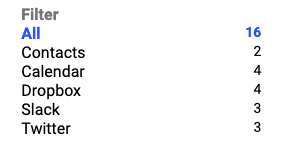

- **Trade-off**: This feature might not be as useful if the search result can fit within one page.

### **The clear button will clear the search box, search results and focus the cursor back to the search bar:**

- **Reason**: Provides more convenience for making new queries.


- **Trade-off**: Users will have to click on the "clear" button. Alternatively, we can consider having results being displayed as the user is typing through the search box. However, this might add complexity on the backend to fetch multiple times as the user is typing. To mitigate this issue, the amount of unnecessary queries can be reduced by using a debouncer.

### **Clicking on the submit button or pressing the 'return' key will make the query:**

- **Reason**: Pressing the 'return' key to submit a query is becoming more intuitive. Additionally, if the tag modal is open, pressing the 'return' key will save the tag instead of running a search query.
- TradeOff: Having a submit button might lead the user to believe that he/she can only submit the search through the click of the button

### **Tags are sorted by alphabet:**

- **Reason**: Sorting will provide convenience for the user to find a specific tag. Additionally, the tag modal and menu will have a vertical scrolling bar if the list of tags get too long.

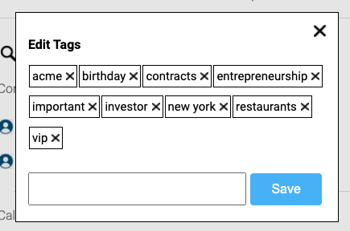

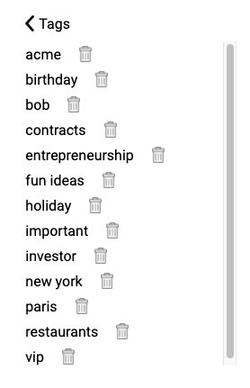

- **Trade-off**: This feature wouldn't be as useful if users have to scroll through a very long list of tags to find a specific tag. Additionally, users might prefer seeing more recent tags at the top. The alternative would be to have a search/auto complete feature imbedded so that the user can quickly find existing tags. This feature is not part of the demo, but here are some visual representations:


### **Long result details are trimmed with an ellipsis:**

- **Reason**: The details might be trimmed to make sure that the format of the results are uniform. Users often just need a portion of the relevant message to get a general sense of whether the search result is relevant. If the user wants more details, then he/she can directly click on the result to expand the details or be directed to the search result (not part of this MVP).


- **Trade-off**: Users will have to click on the search result to get more details. Ideally, we want the snippet to display the relevant portions of the details that are closest to the keyword.

### **The tagged results can be retrieved by searching with a '#':**

- **Reason**: Convenience for quickly retrieving previously stored results based on hashtags.

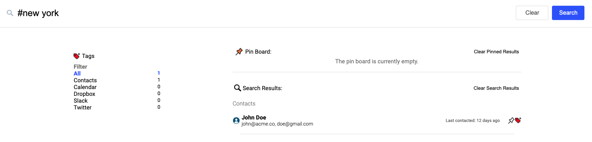

- **Tradeoff**: this behavior might not be as intuitive for many users and require learning (in a tip section).

### **Search results from the pin and search boards can be clear with a single click:**

- **Reason**: This is to add convenience for the user to declutter the pin and search boards. Specifically, the pin board is meant to be used in a temporary fashion.

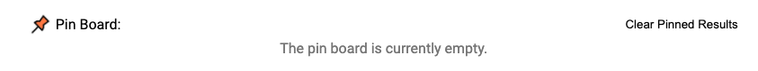


- **Trade-off**: The user might clear the pin and search boards by mistake.

### **Additional filter idea (not included in this MVP):**

If more data sources are added to the app, additional categories in the filter menu would be helpful:

- **Reason**: Better categorization if more applications such as Notion, Evernote, Google Drive, Gmail, linkedIn, etc. are added.


- **Trade-off**: The filter will take more space if the list of apps gets longer. We can then consider making each app category collapsible.

## Built with:

- React 16
- Typescript 4
- ts-loader 8
- Node.js
- Webpack 4
- Eslint 7
